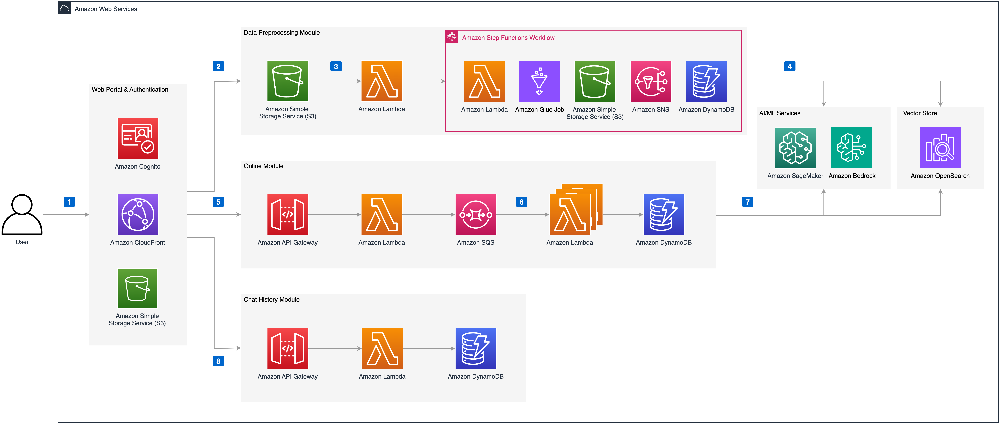

[English](README.md) | 简体中文

<h1 align="center">
  Intelli-Agent
</h1>
<h4 align="center">Intelli-Agent：构建基于代理的应用程序的优化工作流</h4>
<div align="center">
  <h4>
    <a href="https://github.com/aws-samples/Intelli-Agent/commits/main/stargazers"></a>
    <a href="https://github.com/aws-samples/Intelli-Agent/actions/workflows/pull-request-lint.yml"></a>
    <a href="https://opensource.org/license/apache-2-0"></a>
  </h4>
</div>

Intelli-Agent 提供一个高效简洁的工作流程，用于开发可扩展的、生产级别的、基于 agent（代理）的应用。例如：智能对话机器人等

主要功能包括：

1. **企业知识库创建**：用户可以上传各种格式的私有文档（PDF、DOCX、HTML、CSV、TXT、MD、JSON、JSONL、PNG、JPG、JPEG、WEBP）来构建个性化的知识库。

2. **灵活的模式选项**：可选择多种模式（Agent、Chat、RAG）以满足不同需求。例如，Agent 模型可以解释用户意图，选择适当的工具，并根据迭代结果采取行动。

3. **可配置的基于聊天的用户界面**：提供用户友好的聊天界面，便于配置、探索和自定义，以满足您的特定需求。

4. **全面的 RESTful API**：我们功能齐全的 API 便于与现有应用程序集成，增强功能和用户体验。

Intelli-Agent 旨在以最小的开销和最大的效率帮助开发人员快速部署智能、上下文感知的应用程序。

## 目录
- [架构](#architecture)
- [快速开始](#quick-start)
- [API 调用](#api-reference)
- [安全](#security)
- [License](#license)

## 架构

使用默认参数部署此解决方案将在 Amazon Web Services 中构建以下环境：



执行过程如下：

1. 解决方案的前端网站托管在Amazon S3桶中，通过Amazon CloudFront分发。Amazon Cognito用户池为其提供身份验证。
2. 用户通过方案网站上传文档到知识库时，文档会首先上传到Amazon S3桶。
3. Amazon Lambda随即被触发，并触发Amazon Step Functions处理文件。Amazon Step Functions中通过Amazon Glue Job对文档进行解析和切分，并将中间状态分别存储到Amazon DynamoDB和Amazon S3。
4. Amazon Glue Job将切分后的文本块通过部署在Amazon SageMaker Endpoint中的Embedding模型进行向量化，并注入到向量数据库Amazon OpenSearch。其中，如果文档是图片格式（如：png，webp）或pdf格式，Amazon Glue Job会通过Amazon BedRock理解图片并转换成文本。最后Amazon SNS会将执行结果以邮件的方式通知到用户。具体文档处理细节，请参考章节8.2.
5. 当用户在方案网站发送聊天信息时，在线模块的Amazon API Gateway会被触发，前后端通信是通过WebSocket API实现。Amazon API Gateway集成的Amazon Lambda函数将请求消息发送到Amazon SQS防止消息超时。
6. Amazon SQS中的消息会被在线模块的Amazon Lambda消费，根据请求参数执行Agent/RAG/Chat逻辑，并将聊天信息记录到Amazon DynamoDB。Amazon Lambda通过意图识别判断需要使用的工具，并进行相应操作。
7. 如果选择RAG模型，Amazon Lambda通过Amazon SageMaker Endpoint中部署的Embedding模型将查询消息进行向量化，在Amazon OpenSearch中查询到匹配的知识（目前默认返回top 5知识，如需调整，请参考章节8.3），对其进行倒排，然后将知识发送给大语言模型，最后将答案返回给前端。
8. 在聊天时，用户和AI的消息会存储在Amazon DynamoDB中，方案网站通过Amazon API Gateway和Amazon Lambda获取到某次聊天记录，用户可以基于这次聊天记录的内容继续进行聊天。


### 企业知识库创建
数据预处理模块包括格式识别、内容提取、元数据转换和语义分割，无缝地在后台进行。


当收到大量内容注入请求时，它可以通过同时运行多个 Amazon Glue 任务来自动扩展，确保这些请求及时处理。


#### 文本块元数据

文本块元数据定义如下：

| 名称 | 描述 |
| - | - |
|file_path| 存储文件的 S3 路径 |
|file_type| 文件类型，例如 pdf、html |
|content_type| 段落：段落内容 |
|current_heading| 该块所属的标题 |
|chunk_id| 唯一的文本块 ID |
|heading_hierarchy| 用于定位整个文件内容中该块的标题层次 |
|title| 当前部分的标题 |
|level| 标题级别，例如 在 Markdown 中，H1 是 #，H2 是 ## |
|parent| 父部分的块 ID，例如 H2 的父部分是 H1，H3 的父部分是 H2 |
|previous| 同一级别上前一段落的块 ID |
|child| 子部分的文本块 ID |
|next| 同一级别上下一段落的块 ID |
|size| 段落按固定大小拆分后的文本块数量 |

示例：

```
{
	"file_path": "s3://example/intelli-agent-user-guide.pdf",
	"file_type": "pdf",
	"content_type": "paragragh",
	"current_heading": "# Intelli-Agent User Guide WebApp",
	"chunk_id": "$1-4659f607-1",
	"heading_hierarchy": {
		"title": "Intelli-Agent User Guide",
		"level": 1,
		"parent": null,
		"previous": null,
		"child": [
			"$2-038759db",
			"$4-68d6e6ca",
			"$6-e9cdcf68"
		],
		"next": null,
		"size": 2
	}
}

```


### 灵活的模式选项

下图是基于 [langgraph](https://langchain-ai.github.io/langgraph/) 生成的在线逻辑。第一个节点是 **query_preprocess_lambda**，它处理聊天历史记录。然后用户可以从三种模式中选择：聊天模式（chat）、检索生成模式（rag）和代理模式（agent）。**聊天模式（chat）** 让您可以直接与不同的 LLM（如 Anthropic Claude 3）进行交互。**检索生成模式（rag）** 将检索与当前查询相关的内容并让 LLM 回答。**代理模式（agent）** 是最复杂的模式，能够处理复杂的业务场景。根据 **intention_detection_lambda** 提供的最相关意图和 **query_preprocess_lambda** 提供的聊天历史记录，**agent_lambda** 将决定使用哪些工具以及这些信息是否足以回答查询。**parse_tool_calling** 节点将解析 **agent_lambda** 的输出：

* 如果 **agent_lambda** 从工具格式的角度选择了错误的工具，那么会通过 **invalid_tool_calling** 进行重新思考。
* 如果 **agent_lambda** 选择了有效工具，那么会通过 **tool_execute_lambda** 执行该工具。然后，**agent_lambda** 将决定运行结果是否足以回答查询。
* 在某些情况下，**agent_lambda** 决定给出最终回应。对于需要 RAG 的情况，将调用 **rag_retrieve_lambda** 和 **rag_llm_lambda**。对于 **agent_lambda** 需要更多信息的情况，将执行 **give_rhetorical_question** 进行反问。对于需要给出固定回复的情况，将执行 **transfer_reply** 和 **comfort_reply**。**give_final_response** 意味着工具调用的当前结果足以回答查询。


```mermaid
flowchart TD
 subgraph ReAct["ReAct"]
    direction TB
        tools_choose_and_results_generation["tools_choose_and_results_generation"]
        results_evaluation{{"results_evaluation"}}
        tools_execution["tools_execution"]
  end
    _start_["_start_"] --> query_preprocess["query_preprocess"]
    query_preprocess == chat mode ==> llm_direct_results_generation["llm_direct_results_generation"]
    query_preprocess == rag mode ==> all_knowledge_retrieve["all_knowledge_retrieve"]
    query_preprocess == agent mode ==> intention_detection["intention_detection"]
    all_knowledge_retrieve --> llm_rag_results_generation["llm_rag_results_generation"]
    intention_detection -- similar query found --> matched_query_return["matched_query_return"]
    intention_detection -- intention detected --> tools_choose_and_results_generation
    tools_choose_and_results_generation --> results_evaluation
    results_evaluation -. invalid tool calling .-> tools_choose_and_results_generation
    results_evaluation -. valid tool calling .-> tools_execution
    results_evaluation -. no need tool calling .-> final_results_preparation["final_results_preparation"]
    tools_execution --> tools_choose_and_results_generation
    llm_direct_results_generation --> _end_["_end_"]
    llm_rag_results_generation --> _end_
    matched_query_return --> final_results_preparation
    final_results_preparation --> _end_
     tools_choose_and_results_generation:::process
     results_evaluation:::process
     tools_execution:::process
     query_preprocess:::process
     llm_direct_results_generation:::process
     all_knowledge_retrieve:::process
     intention_detection:::process
     llm_rag_results_generation:::process
     matched_query_return:::process
     final_results_preparation:::process
    style query_preprocess fill:#FF6D00,color:#FFFFFF
    style ReAct fill:#FFCDD2,color:#D50000
```

## 快速开始

[](https://aws-gcr-solutions.s3.cn-north-1.amazonaws.com.cn/intelli-agent/videos/intelli-agent-deployment.mp4 "Intelli-Agent Deployment")

Follow these steps to get started:

1. [预置条件](#prerequisites)
2. [CDK 部署](#deploy-cdk-template)

### 预置条件

执行以下命令以安装 Python、Git、npm、Docker 等依赖项，并为 Amazon OpenSearch 服务创建一个服务关联角色。如果这些依赖项已经安装，可以跳过此步骤。

```bash
wget https://raw.githubusercontent.com/aws-samples/Intelli-Agent/dev/source/script/setup_env.sh
sh setup_env.sh
```

Executing the following command to clone the GitHub repo:
```bash
git clone <this repo>
```


Navigate to the script directory and run the build.sh script. This script requires an S3 bucket name as an argument, which will be used to upload the model. Please make sure the bucket name is located in the same region as the CDK deployment. It also requires ETL image name, ETL image tag, and AWS region as arguments. The ETL image will be pushed to your ECR repo with the image name you specified.

```bash
cd source/script
sh build.sh -b <S3 bucket name> -i <ETL model name> -t <ETL tag name> -r <AWS region>
```

For example:

```bash
sh build.sh -b intelli-agent-model-bucket -i etl-image -t latest -r us-east-1
```


### Deploy CDK Template
Please make sure **docker** is installed and the CDK command is executed in the **same region** of the model files which were uploaded in the previous step. 

Start the deployment by executing the following command:
```bash
cd source/infrastructure
npx cdk deploy --parameters S3ModelAssets=<S3 Bucket Name> --parameters SubEmail=<email address> --parameters EtlImageName=<ETL model name> --parameters ETLTag=<ETL tag name>
```

To deploy the offline process only, you can configure context parameters to skip the online process. 

```bash
npx cdk deploy --parameters S3ModelAssets=<S3 bucket name> --parameters SubEmail=<email address> --parameters EtlImageName=<ETL model name> --parameters ETLTag=<ETL tag name> --context DeploymentMode="OFFLINE_EXTRACT"
```

#### Deployment Parameters
| Parameter | Description |
|-|-|
| S3ModelAssets | Your bucket name to store models |
| SubEmail | Your email address to receive notifications |
| OpenSearchIndex | OpenSearch index name to store the knowledge, if the index does not exist, the solution will create one |
| EtlImageName | ETL image name, eg. etl-model, it is set when you executing source/model/etl/code/model.sh script |
| EtlTag | ETL tag, eg. latest, v1.0, v2.0, the default value is latest, it is set when you executing source/model/etl/code/model.sh script |


#### Optional Context Parameters

| Context | Description |
|---------|-------------|
| DeploymentMode | The mode for deployment. There are two modes: `OFFLINE_EXTRACT`, and `ALL`. Default deployment mode is `ALL`. |


### API Reference
After CDK deployment, you can use a HTTP client such as Postman/cURL to invoke the API by following below API schema. 
- [LLM API Schema](https://github.com/aws-samples/Intelli-Agent/blob/main/docs/LLM_API_SCHEMA.md): send question to LLM and get a response.
- [ETL API Schema](https://github.com/aws-samples/Intelli-Agent/blob/main/docs/ETL_API_SCHEMA.md): upload knowledge to the vector database.
- [AOS API Schema](https://github.com/aws-samples/Intelli-Agent/blob/main/docs/AOS_API_SCHEMA.md): search data in the vector database.


## Testing
For detailed test information, please refer to the [Test Doc](https://github.com/aws-samples/Intelli-Agent/blob/dev/tests/README.md)

## Contribution
See [CONTRIBUTING](CONTRIBUTING.md#security-issue-notifications) for more information.

## License
This project is licensed under the Apache-2.0 License.