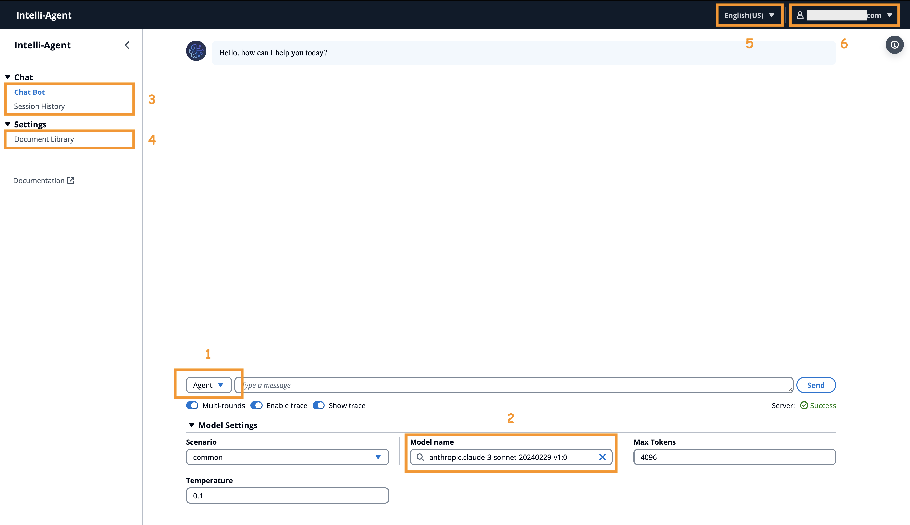
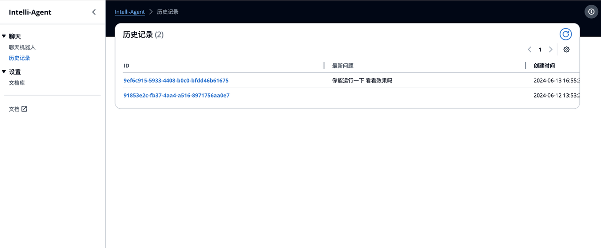

[English](README.md) | 简体中文

<h1 align="center">
  Intelli-Agent
</h1>
<h4 align="center">Intelli-Agent：构建基于代理的应用程序的优化工作流</h4>
<div align="center">
  <h4>
    <a href="https://github.com/aws-samples/Intelli-Agent/commits/main/stargazers"></a>
    <a href="https://github.com/aws-samples/Intelli-Agent/actions/workflows/pull-request-lint.yml"></a>
    <a href="https://opensource.org/license/apache-2-0"></a>
  </h4>
</div>

Intelli-Agent 提供一个高效简洁的工作流程，用于开发可扩展的、生产级别的、基于 agent（代理）的应用。例如：智能对话机器人等

主要功能包括：

1. **企业知识库创建**：用户可以上传各种格式的私有文档（PDF、DOCX、HTML、CSV、TXT、MD、JSON、JSONL、PNG、JPG、JPEG、WEBP）来构建个性化的知识库。

2. **灵活的模式选项**：可选择多种模式（Agent、Chat、RAG）以满足不同需求。例如，Agent 模型可以解释用户意图，选择适当的工具，并根据迭代结果采取行动。

3. **可配置的基于聊天的用户界面**：提供用户友好的聊天界面，便于配置、探索和自定义，以满足您的特定需求。

4. **全面的 RESTful API**：我们功能齐全的 API 便于与现有应用程序集成，增强功能和用户体验。

Intelli-Agent 旨在以最小的开销和最大的效率帮助开发人员快速部署智能、上下文感知的应用程序。

## 目录
- [架构](#架构)
- [快速开始](#快速开始)
- [API 调用](#API调用)
- [FAQ](#FAQ)
- [贡献](#贡献)
- [License](#license)

## 架构

使用默认参数部署此解决方案将在 Amazon Web Services 中构建以下环境：


执行过程如下：

1. 解决方案的前端网站托管在Amazon S3桶中，通过Amazon CloudFront分发。Amazon Cognito用户池为其提供身份验证。
2. 用户通过方案网站上传文档到知识库时，文档会首先上传到Amazon S3桶。
3. Amazon Lambda随即被触发，并触发Amazon Step Functions处理文件。Amazon Step Functions中通过Amazon Glue Job对文档进行解析和切分，并将中间状态分别存储到Amazon DynamoDB和Amazon S3。
4. Amazon Glue Job将切分后的文本块通过部署在Amazon SageMaker Endpoint中的Embedding模型进行向量化，并注入到向量数据库Amazon OpenSearch。其中，如果文档是图片格式（如：png，webp）或pdf格式，Amazon Glue Job会通过Amazon BedRock理解图片并转换成文本。最后Amazon SNS会将执行结果以邮件的方式通知到用户。具体文档处理细节，请参考章节8.2.
5. 当用户在方案网站发送聊天信息时，在线模块的Amazon API Gateway会被触发，前后端通信是通过WebSocket API实现。Amazon API Gateway集成的Amazon Lambda函数将请求消息发送到Amazon SQS防止消息超时。
6. Amazon SQS中的消息会被在线模块的Amazon Lambda消费，根据请求参数执行Agent/RAG/Chat逻辑，并将聊天信息记录到Amazon DynamoDB。Amazon Lambda通过意图识别判断需要使用的工具，并进行相应操作。
7. 如果选择RAG模型，Amazon Lambda通过Amazon SageMaker Endpoint中部署的Embedding模型将查询消息进行向量化，在Amazon OpenSearch中查询到匹配的知识（目前默认返回top 5知识，如需调整，请参考章节8.3），对其进行倒排，然后将知识发送给大语言模型，最后将答案返回给前端。
8. 在聊天时，用户和AI的消息会存储在Amazon DynamoDB中，方案网站通过Amazon API Gateway和Amazon Lambda获取到某次聊天记录，用户可以基于这次聊天记录的内容继续进行聊天。


### 企业知识库创建
数据预处理模块包括格式识别、内容提取、元数据转换和语义分割，无缝地在后台进行。


当系统收到大量内容注入请求时，它可以通过同时运行多个 Amazon Glue 任务来自动扩展，确保这些请求及时处理。


#### 文本块元数据

文本块元数据定义如下：

| 名称 | 描述 |
| - | - |
|file_path| 存储文件的 S3 路径 |
|file_type| 文件类型，例如 pdf、html |
|content_type| 段落：段落内容 |
|current_heading| 该块所属的标题 |
|chunk_id| 唯一的文本块 ID |
|heading_hierarchy| 用于定位整个文件内容中该块的标题层次 |
|title| 当前部分的标题 |
|level| 标题级别，例如 在 Markdown 中，H1 是 #，H2 是 ## |
|parent| 父部分的块 ID，例如 H2 的父部分是 H1，H3 的父部分是 H2 |
|previous| 同一级别上前一段落的块 ID |
|child| 子部分的文本块 ID |
|next| 同一级别上下一段落的块 ID |
|size| 段落按固定大小拆分后的文本块数量 |

示例：

```
{
	"file_path": "s3://example/intelli-agent-user-guide.pdf",
	"file_type": "pdf",
	"content_type": "paragragh",
	"current_heading": "# Intelli-Agent User Guide WebApp",
	"chunk_id": "$1-4659f607-1",
	"heading_hierarchy": {
		"title": "Intelli-Agent User Guide",
		"level": 1,
		"parent": null,
		"previous": null,
		"child": [
			"$2-038759db",
			"$4-68d6e6ca",
			"$6-e9cdcf68"
		],
		"next": null,
		"size": 2
	}
}

```


### 灵活的模式选项

下图是基于 [LangGraph](https://langchain-ai.github.io/langgraph/) 生成的在线逻辑。第一个节点是 **query_preprocess_lambda**，它处理聊天历史记录。然后用户可以从三种模式中选择：聊天模式（chat）、检索生成模式（rag）和代理模式（agent）。**聊天模式（chat）** 让您可以直接与不同的 LLM（如 Anthropic Claude 3）进行交互。**检索生成模式（rag）** 将检索与当前查询相关的内容并让 LLM 回答。**代理模式（agent）** 是最复杂的模式，能够处理复杂的业务场景。根据 **intention_detection_lambda** 提供的最相关意图和 **query_preprocess_lambda** 提供的聊天历史记录，**agent_lambda** 将决定使用哪些工具以及这些信息是否足以回答查询。**parse_tool_calling** 节点将解析 **agent_lambda** 的输出：

* 如果 **agent_lambda** 从工具格式的角度选择了错误的工具，那么会通过 **invalid_tool_calling** 进行重新思考。
* 如果 **agent_lambda** 选择了有效工具，那么会通过 **tool_execute_lambda** 执行该工具。然后，**agent_lambda** 将决定运行结果是否足以回答查询。
* 在某些情况下，**agent_lambda** 决定给出最终回应。对于需要 RAG 的情况，将调用 **rag_retrieve_lambda** 和 **rag_llm_lambda**。对于 **agent_lambda** 需要更多信息的情况，将执行 **give_rhetorical_question** 进行反问。对于需要给出固定回复的情况，将执行 **transfer_reply** 和 **comfort_reply**。**give_final_response** 意味着工具调用的当前结果足以回答查询。


```mermaid
flowchart TD
 subgraph ReAct["ReAct"]
    direction TB
        tools_choose_and_results_generation["tools_choose_and_results_generation"]
        results_evaluation{{"results_evaluation"}}
        tools_execution["tools_execution"]
  end
    _start_["_start_"] --> query_preprocess["query_preprocess"]
    query_preprocess == chat mode ==> llm_direct_results_generation["llm_direct_results_generation"]
    query_preprocess == rag mode ==> all_knowledge_retrieve["all_knowledge_retrieve"]
    query_preprocess == agent mode ==> intention_detection["intention_detection"]
    all_knowledge_retrieve --> llm_rag_results_generation["llm_rag_results_generation"]
    intention_detection -- similar query found --> matched_query_return["matched_query_return"]
    intention_detection -- intention detected --> tools_choose_and_results_generation
    tools_choose_and_results_generation --> results_evaluation
    results_evaluation -. invalid tool calling .-> tools_choose_and_results_generation
    results_evaluation -. valid tool calling .-> tools_execution
    results_evaluation -. no need tool calling .-> final_results_preparation["final_results_preparation"]
    tools_execution --> tools_choose_and_results_generation
    llm_direct_results_generation --> _end_["_end_"]
    llm_rag_results_generation --> _end_
    matched_query_return --> final_results_preparation
    final_results_preparation --> _end_
     tools_choose_and_results_generation:::process
     results_evaluation:::process
     tools_execution:::process
     query_preprocess:::process
     llm_direct_results_generation:::process
     all_knowledge_retrieve:::process
     intention_detection:::process
     llm_rag_results_generation:::process
     matched_query_return:::process
     final_results_preparation:::process
    style query_preprocess fill:#FF6D00,color:#FFFFFF
    style ReAct fill:#FFCDD2,color:#D50000
```

## 快速开始

部署视频：

[](https://aws-gcr-solutions.s3.cn-north-1.amazonaws.com.cn/intelli-agent/videos/intelli-agent-deployment.mp4 "Intelli-Agent Deployment")

按照以下步骤开始：


1. [预置条件](#预置条件)
2. [部署方案](#部署方案)

### 预置条件

执行以下命令以安装 Python、Git、npm、Docker 等依赖项，并为 Amazon OpenSearch 服务创建一个服务关联角色。如果这些依赖项已经安装，可以跳过此步骤。
setup_env.sh脚本适配Amazon Linux 2023，如果您使用其他操作系统，请手动安装这些依赖。

```bash
wget https://raw.githubusercontent.com/aws-samples/Intelli-Agent/dev/source/script/setup_env.sh
sh setup_env.sh
```

执行以下命令克隆GitHub代码：

```bash
git clone git@github.com:aws-samples/Intelli-Agent.git
cd Intelli-Agent
```

执行以下命令配置 AWS 账号（请跳过此步骤如果您已经配置过 AWS 账号），参考 [AWS CLI](https://docs.aws.amazon.com/cli/latest/reference/configure/) 命令获取更多使用说明。

```bash
aws configure
```


请进入到脚本目录并运行 build.sh 脚本。此脚本需要一个 S3 存储桶名称作为参数，用于上传模型。请确保存储桶名称位于与 CDK 部署相同的 AWS 区域内。例如：如果S3桶在us-west-2，则您只能在us-west-2进行CDK部署。此外，还需要提供 ETL 镜像名称、ETL 镜像标签和 AWS 区域作为参数。ETL 镜像将会被推送到您指定的 ECR 仓库中。

```bash
cd source/script
sh build.sh -b <S3 bucket name> -i <ETL model name> -t <ETL tag name> -r <AWS region>
```

例如：

```bash
sh build.sh -b intelli-agent-model-bucket -i intelli-agent-etl -t latest -r us-east-1
```


### 部署方案
如果您的账号是首次使用 AWS CDK 部署资源，请参考[此文档](https://docs.aws.amazon.com/cdk/v2/guide/bootstrapping-env.html)进行 CDK boostrap。

```bash
cdk bootstrap aws://<Your AWS account ID>/<AWS region>
```

本方案部署可以有两种选项：
1. 部署`全部模块`。即可实现从知识库构建到在线交互问答全量功能。
2. 仅部署`知识库构建（离线处理）`模块。

#### 选项1 部署全部模块

执行如下命令进行部署，其中，S3ModelAssets，EtlImageName和ETLTag请使用在`预置条件`章节中您设置过的参数。（默认部署模式）


```bash
cd source
aws ecr-public get-login-password --region us-east-1 | docker login --username AWS --password-stdin public.ecr.aws
cd infrastructure
npx cdk deploy --parameters S3ModelAssets=<Your S3 Bucket Name> --parameters SubEmail=<Your email address> --parameters EtlImageName=<Your ETL model name> --parameters ETLTag=<Your ETL tag name> --require-approval never
```


示例：

```bash
npx cdk deploy --rollback true --parameters S3ModelAssets=intelli-agent-model-bucket --parameters SubEmail=foo@email.com --parameters EtlImageName=intelli-agent-etl --parameters ETLTag=latest --require-approval never
```


##### 部署参数
| 参数 | 参数类型 | 描述 |
| - | - | - |
| S3ModelAssets | 必填 | 存储模型的您的 S3 存储桶名称 |
| SubEmail | 必填 | 接收通知的您的电子邮件地址 |
| EtlImageName | 必填 | ETL 镜像名称，例如 etl-model，在执行 source/model/etl/code/model.sh 脚本时设置 |
| EtlTag | 必填 | ETL 标签，例如 latest、v1.0、v2.0，默认值为 latest，在执行 source/model/etl/code/model.sh 脚本时设置 |
| DeploymentMode | 选填 | 不填或ALL |


#### 选项2 仅部署`知识库构建（离线处理）`模块

如果仅要求对文档进行解析切片并将切片后的文本块上传到 S3，而不需要将文本块注入到 Amazon OpenSearch，执行如下命令进行部署，其中，S3ModelAssets，EtlImageName和ETLTag请使用在“前置条件”章节中您设置过的参数。

```bash
cd source
aws ecr-public get-login-password --region us-east-1 | docker login --username AWS --password-stdin public.ecr.aws
cd infrastructure
npx cdk deploy --parameters S3ModelAssets=<Your S3 Bucket Name> --parameters SubEmail=<Your email address> --parameters EtlImageName=<Your ETL model name> --parameters ETLTag=<Your ETL tag name> --context DeploymentMode="OFFLINE_EXTRACT" --require-approval never
```

##### 部署参数
| 参数 | 参数类型 | 描述 |
| - | - | - |
| S3ModelAssets | 必填 | 存储模型的您的 S3 存储桶名称 |
| SubEmail | 必填 | 接收通知的您的电子邮件地址 |
| EtlImageName | 必填 | ETL 镜像名称，例如 etl-model，在执行 source/model/etl/code/model.sh 脚本时设置 |
| EtlTag | 必填 | ETL 标签，例如 latest、v1.0、v2.0，默认值为 latest，在执行 source/model/etl/code/model.sh 脚本时设置 |
| DeploymentMode | 必填 | OFFLINE_EXTRACT |

#### 方案信息

部署后您可以在 CloudFormation 控制台中找到包含`intelli-agent`的堆栈，在Output标签页中可以找到方案信息，常用的信息解释如下：

| 名称	| 描述 |
| - | - |
| WebPortalURL |	Intelli-Agent前端网站链接 |
| APIEndpointAddress |	RestFul API地址，主要用数据预处理、聊天记录等功能 |
| WebSocketEndpointAddress | WebSocket API地址，主要用于聊天功能 |
| ChunkBucket | 文档预处理后的中间状态保存在此S3桶中 |

### 更新已有的部署

您可以通过 CDK 更新已有的部署，具体命令如下：

```bash
cd source
aws ecr-public get-login-password --region us-east-1 | docker login --username AWS --password-stdin public.ecr.aws
cd infrastructure
npx cdk deploy --rollback true --parameters S3ModelAssets=<Your S3 Bucket Name> --parameters SubEmail=<Your email address> --parameters EtlImageName=<Your ETL model name> --parameters ETLTag=<Your ETL tag name> --require-approval never
```

示例：

```bash
npx cdk deploy --rollback true --parameters S3ModelAssets=intelli-agent-model-bucket --parameters SubEmail=foo@email.com --parameters EtlImageName=intelli-agent-etl --parameters ETLTag=latest --require-approval never
```


### 卸载解决方案

登录 AWS 控制台，进入到 CloudFormation 页面，选择包含`intelli-agent`关键字的堆栈，点击删除按钮。


## 功能介绍



### 1 对话模型
目前支持3种对话模式：agent，RAG和chat。
- Agent：适用于需要通过对话，由大模型判断下一步需要调用的资源（如已有或自定义的tools）的场景。
- RAG：适合需要基于知识库的对话能力。注：需要提前上传文档进入`文档库`。
- Chat：适合随意聊天，直接体验大语言模型的对话能力。

### 2 大语言模型切换
目前支持LLM如下：
- Claude3 Haiku
- Claude3 Sonnet
- Claude3.5 Sonnet

### 3 聊天窗口
聊天区域由两个功能组成：聊天机器人和历史记录。
聊天机器人可以即时开启一段新的基于支持的LLM模型的对话。
历史记录 -> 需要重启的聊天记录ID，页面即会展示出过去的历史记录。用户可以在此基础上继续对话。




### 4 文档库（知识库）
目前文档库（即RAG所需的知识库）支持基于文档的创建（一次上传一个）、删除（一次可删除多个）。
- 支持文档格式（12种）：pdf, docx, txt, csv, jsonl, json, html, md, png, jpg, jpeg, webp
- UI上传文档大小限制：10MB

提示：
- 如果用户重复上传了同名的文档，后台将会用最新的文档进行覆盖。
- 创建文档 -> 选择文件并点击上传后，后台操作分两部分：文档上传和离线处理。全部完成后才会在状态栏展示`完成`。
- 示例：


### 5 用户管理
右上角显示当前用户名。点击`退出登录`即可退出。

### 6 界面展示语种切换
目前支持简体中文和英文。


## API调用
在 CDK 部署后，您可以使用 HTTP client，例如 Postman/cURL 来调取 API.
- [llm api schema](docs/llm_api_schema.md): send question to llm and get a response.
- [ETL API Schema](docs/ETL_API_SCHEMA.md): upload knowledge to the vector database.
- [AOS API Schema](docs/AOS_API_SCHEMA.md): search data in the vector database.


## FAQ

### 目前各处理环节的模型选型是什么
目前各环节使用的模型如下，是团队内部测试后、选用的当下效果比较理想的选项。支持客户自定义更换。详细模型更换。

| Function | Model |
| - | - |
| Rerank | BGE-reranker-large |
| Embedding | BCE |
| LLM | Claude3/Claude3.5 |

### 如何获取支持
通过在 GitHub 上创建 Issue 获取支持。

### 部署后，如何获取初始用户名和密码
在CDK部署时您指定了SubEmail参数，它是用于接受邮件通知的邮箱地址，当CDK部署成功后，初始用户名和密码会发送到此邮箱。

### 如何切分文档
各种类型的文档首先会转换成Markdown格式，然后根据段落进行切分，如果切分后的段落超过最大token（默认值500，用户可以在glue-job-script.py中自定义），则进行二次切分，切分后的文本块和元数据会记录在S3桶中，在向量化后最终注入向量数据库。

### 如何注入意图数据
- 根据[文档](docs/auth.md)获取jwt token，并参考postman使用的方式。
- 根据[文档](docs/ETL_API_SCHEMA.md)进行注入。注入参数可以参考下面的格式，替换其中S3相关参数即可。

```json
{
    "s3Bucket": "your-bucket-name",
    "s3Prefix": "s3path/default-intent.jsonl",
    "offline": "true",
    "qaEnhance": "false",
    "workspaceId": "default-intent",
    "operationType": "create",
    "documentLanguage": "zh",
    "indexType": "qq"
}
```

- 注入数据格式

```json
{"question": "你好", "answer": {"intent": "chat"}}
```

### 如何更新ETL使用的资源
目前方案在持续更新当中，对于文档解析部分更新需要手动进行

1. [可选] 更新文档解析模型Endpoint

```bash
# 在执行sh build.sh时输入一个新的ETL tag
cd source/script
sh build.sh -b <S3 bucket name> -i <ETL model name> -t <new ETL tag name> -r <AWS region>

# 在执行cdk deploy时输入一个新的ETL tag，触发ETL endpoint的更新
npx cdk deploy --rollback true --parameters S3ModelAssets=<Your S3 Bucket Name> --parameters SubEmail=<Your email address> --parameters EtlImageName=<Your ETL model name> --parameters ETLTag=<Your new ETL tag name> --require-approval never
```

2. 手动更新一下ETL依赖的whl包，需要先确认一下ETL Job中--extra-py-files对应的路径


然后将source/lambda/job/dep/dist/llm_bot_dep-0.1.0-py3-none-any.whl 上传到Glue依赖的位置

```bash
aws s3 cp source/lambda/job/dep/dist/llm_bot_dep-0.1.0-py3-none-any.whl s3://<Your Glue job bucket>/llm_bot_dep-0.1.0-py3-none-any.whl
```


## 测试
参考[测试文档](https://github.com/aws-samples/Intelli-Agent/blob/dev/tests/README.md)获取更多测试信息。

## 贡献
参考[贡献文档](CONTRIBUTING.md#security-issue-notifications)获取更多信息。

## License
此项目采用 Apache-2.0 License。
